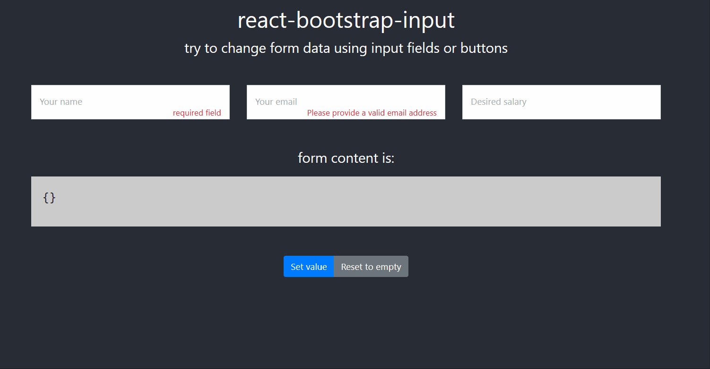

# react-bootstrap-input

This package provides a simple yet powerful input component with the following features:

-   pattern-based validation
-   form-group validation
-   data-binding
-   input-masks and formatting

## basics

Create a host component representing your form (a filter form in this example), then place in the render function a few input fields:

```
<SimpleInput
    formObj={filter}
    name="email"
    placeholder="Your email"
    onChange={filterChange}
    required
    validated
    pattern={'^[a-zA-Z0-9.!#$%&’*+/=?^_`{|}~-]+@[a-zA-Z0-9-]+(?:.[a-zA-Z0-9-]+)*$'}
    errorMessage="Please provide a valid email address"
/>
```

Provide the data-variable representing your form ahd the change function:

```
const [filter, setfilter] = useState({});
const filterChange = updatedItem => {
    setfilter(updatedItem);
};
```

Enjoy!


This project was bootstrapped with [Create React App](https://github.com/facebook/create-react-app).
